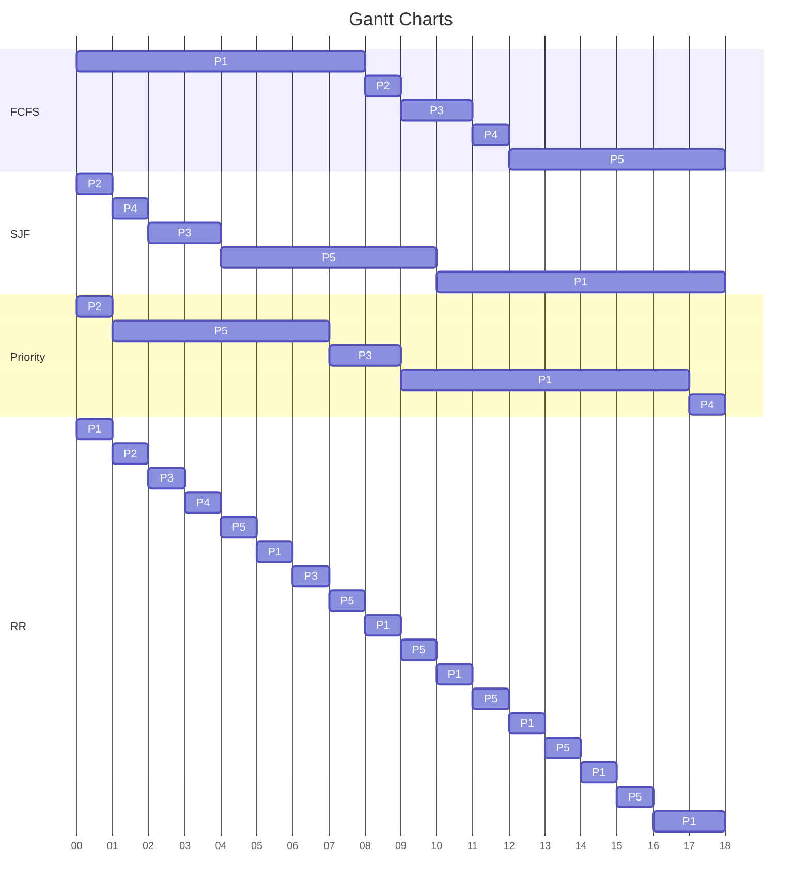

```mermaid
gantt
    title Gantt Charts
    dateFormat  s
        axisFormat  %S
        section FCFS
            P1 :a1, 0, 8s
            P2 :a2, after a1, 1s
            P3 :a3, after a2, 2s
            P4 :a4, after a3, 1s
            P5 :a5, after a4, 6s
    
        section SJF
            P2 :b2, 0, 1s
            P4 :b4, after b2  , 1s
            P3 :b3, after b4  , 2s
            P5 :b5, after b3  , 6s
            P1 :b1, after b5, 8s
            
        section Priority
            P2 :c2, 0, 1s
            P5 :c5, after c2  , 6s
            P3 :c3, after c5  , 2s
            P1 :c1, after c3, 8s
            P4 :c4, after c1  , 1s
    
        section RR
            P1 :d1, 0, 1s 
            P2 :d2, after d1  , 1s
            P3 :d3, after d2  , 1s
            P4 :d4, after d3  , 1s
            P5 :d5, after d4  , 1s
            P1 :d6, after d5  , 1s
            P3 :d7, after d6  , 1s
            P5 :d8, after d7  , 1s
            P1 :d9, after d8  , 1s
            P5 :d10, after d9  , 1s
            P1 :d11, after d10  , 1s
            P5 :d12, after d11  , 1s
            P1 :d13, after d12  , 1s
            P5 :d14, after d13  , 1s
            P1 :d15, after d14  , 1s
            P5 :d16, after d15  , 1s
            P1 :d17, after d16  , 2s
```